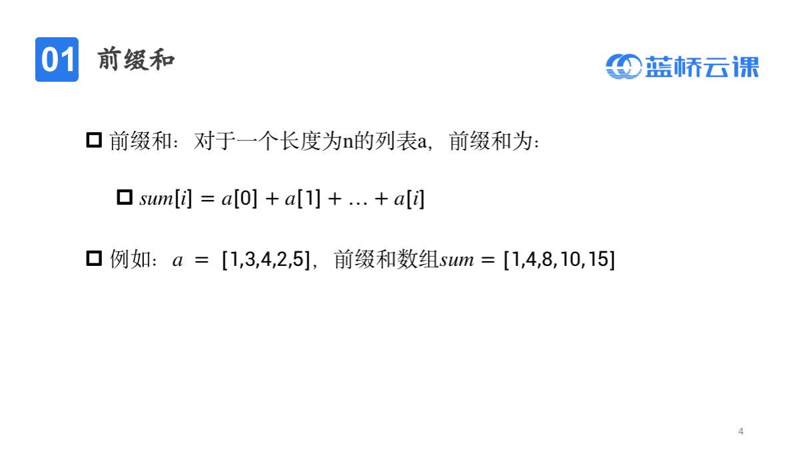
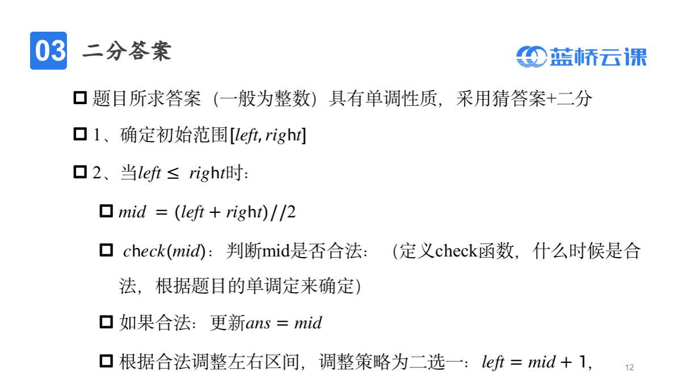

# Python刷题总结

## 一、语言基础

## 二、基础算法

### 一、基础算法

#### 1、时间复杂度

#### 2、枚举

#### 3、模拟

#### 4、递归

#### 5、进制转换

> ```python
> # 任意进制转十进制
> def K_to_Ten(k, num):
>     ans = 0
>     for i in num:
>         ans = ans * k + char_to_int[i]
>     return ans
> 
> 
> int_to_char = "0123456789ABCDEF"
> char_to_int = {}
> for idx, char in enumerate(int_to_char):
>     char_to_int[char] = idx
> print(char_to_int)
> k, n = map(int, input().split())
> n = str(n)
> print(K_to_Ten(k, n))
> ```
>
> ```python
> # 十进制转任意进制
> def Ten_to_K(k, num):
>     ans = ""
>     while num != 0:
>         ans += int_to_char[num % k]
>         num //= k
>     return ans[::-1]
> int_to_char = "0123456789ABCDEF"
> k, n = map(int, input().split())
> print(Ten_to_K(k, n))
> ```

#### 6、前缀和




#### 7、差分


#### 8、离散化

#### 9、贪心

#### 10、双指针

#### 11、二分




> ```python
> def check(x)
> 	pass		# 判断取值是否合法
> 
> left, right, ans = 初始化
> while left <= right:
>  mid = left + (right - left) / 2
>  if check(mid):
>      ans = mid
>      left = mid + 1
>  else::
>      right = mid - 1
> print(ans)       
> ```
>
> 

#### 12、倍增

#### 13、构造

#### 14、位运算

> - 判断奇偶性，即二进制最后一位
>   - `x & 1`
> - 求二进制的第 i 位
>   - `(x >> i) & 1`
> - 将二进制的第 i 位变为 1
>   - `x | (1 << i)`
> - 将二进制的第 i 位 变 0
>   - `x & ~(1 << i)`
> - 获取 x 的最低位的 1
>   - `Lowbit(x) = x & (-x)`


### 二、排序

#### 1、冒泡排序

#### 2、选择排序

#### 3、插入排序

#### 4、快速排序

#### 5、归并排序

#### 6、桶排序

## 三、搜索

### 一、DFS

#### 一、DFS基础

#### 二、DFS回溯

#### 三、DFS剪枝

#### 四、记忆化搜索

### 二、BFS

## 四、动态规划

### 一、动态规划基础

#### 1、线性DP

#### 2、二维DP

#### 3、LIS 最长上升子序列

```python
# dp[i] 表示以第 i 个数结尾的最长上升子序列的长度
# 如果一个上升子序列的最大值小于在他后面的数，则这个数和原上升子序列可以组成新的上升子序列
# 每一个数都可以当作是长度为 1 的最长上升子序列


n = int(input())
li = list(map(int, input().split()))
dp = [1] * (n)
for i in range(n):
	for j in range(i):
		if li[j] < li[i]:
         dp[i] = max(dp[j] + 1, dp[i])
print(max(dp))
```


#### 4、LCS 最长公共子序列


> ```python
> # dp[i][j] 表示字符 s1 前 i 个与字符 s2 前 j 个的最长公共子序列的长度
> n, m = map(int, input().split())		# 读入两个字符串长度
> s1 = [0] + list(map(int, input().split()))			# 使下标从 0 开始
> s2 = [0] + list(map(int, input().split()))
> dp = [[0] * (m + 1) for _ in range(n + 1)]
> for i in range(1, n + 1):
>  for j in range(1, m + 1):
>      if s1[i] == s2[j]:
>          dp[i][j] = dp[i - 1][j - 1] + 1
>      else:
>          dp[i][j] = max(dp[i - 1][j], dp[i][j - 1]) + 1
> print(dp[n][m]) 
> 
> # 输出最长公共子序列
> ans = []
> x, y = n, m
> while x != 0 and y != 0:
>  if dp[x][y] == dp[x - 1][y]:
>      x -= 1
>  elif dp[x][y] == dp[x][y - 1]:
>      y -= 1
>  else:
>      ans.append(s1[x])
>      x -= 1
>      y -= 1
> print(*ans[::-1])        
> 
> ```
>
> 

### 二、背包问题

#### 1、0-1背包


> ```python
> # dp[i][j] 表示选择第 i 个物品，容量为 j
> # 状态转移方程为
> 
> n, V = map(int, input().split())		# 读入物品数量和背包容量
> dp = [[0] * (V + 1) for _ in range(n + 1)]
> for i in range(1, n + 1):				# 选择第 i 个物品
>  w, v = map(int, input().split())	# 读入物品体积和价值
>  for j in range(V + 1):				
>      if j < w:					
>          # 若当前背包容量小于物品体积，从前一个物品，容量为 j 转移
>          dp[i][j] = dp[i - 1][j]
>      else:
>          # 否则，当前储存值为不选、选当前物品的最大价值
>          # 不选：dp[i - 1][j]
>          # 选：dp[i - 1][j - w] + v
>          dp[i][j] = max(dp[i - 1][j], dp[i - 1][j - w] + v)
> print(dp[n][V])            
> ```
>
> 


> ```python
> n, V = map(int, input().split())
> dp = [0] * (V + 1)
> for i in range(1, n + 1):
>  w, v = map(int, input().split())
>  # 必须从大到小
>  for j in range(V, w - 1, -1):
>      dp[j] = max(dp[j], dp[j - w] + v)
> print(dp[V])        
> ```
>
> 

#### 2、完全背包


> ```python 
> n, V = map(int, input().split())		# 读入物品数量和背包总量
> dp = [[0] * (V + 1) for _ in range(n)]
> for i in range(1, n + 1):
>  w, v = map(int, input().split())	# 读入每一个物体的体积和价值
>  for j in range(V + 1):
>      if j < w:
>          dp[i][j] = dp[i - 1][j]
>      else:
>          dp[i][j] = max(dp[i - 1][j], dp[i][j - w] + v)
> print(dp[n][V])            
> ```
>
> 


> ```python
> n, V = map(int, input().split())
> dp = [0] * (V + 1)
> for i in range(1, n + 1):
>  w, v = map(int, input().split())
>  for j in range(w, V + 1):
>      dp[j] = max(dp[j], dp[j - w] + v)
> print(dp[V])       
> ```
>
> 


#### 3、多重背包


> ```python
> n, V = map(int, input().split())
> dp = [[0] * (V + 1) for _ in range(n)]
> for i in range(1, n + 1):
>  w, v, s = map(int, input().split())
>  for j in range(V + 1):
>      for k in range(min(s, j // w) + 1):
>          dp[i][j] = max(dp[i][j], dp[i - 1][j - k * w] + k * v)
> print(dp[n][V])            
> ```
>
> 


#### 4、单调队列多重背包

#### 5、二维费用背包&分组背包

### 三、树形DP

[P2014 CTSC1997\] 选课 - 洛谷 | 计算机科学教育新生态 (luogu.com.cn)](https://www.luogu.com.cn/problem/P2014)

#### 1、自上而下树型DP

#### 2、自下而上树型DP

#### 3、路径相关树型DP

#### 4、换根DP


### 四、区间DP


[1.石子合并 - 蓝桥云课 (lanqiao.cn)](https://www.lanqiao.cn/problems/1233/learning/?page=1&first_category_id=1&problem_id=1233)

> ```python
> n = int(input())        
> li = [0] + list(map(int, input().split()))
> dp = [[float('inf')] * (n + 1) for _ in range(n + 1)]       # dp[i][j] 表示合并 i ~ j 堆石子的最小花费
> for i in range(1, n + 1):                                   # 前缀和
>  li[i] += li[i - 1]
>  dp[i][i] = 0                                            # 只有一堆的石子不需要合并，花费为0
> for l in range(2, n + 1):                                   # 枚举区间长度
>  for i in range(1, n - l + 2):                           # 枚举区间左端点
>      j = i + l - 1                                       # 区间右端点
>      for k in range(i, j):                               # 选择 i ~ j 区间中某一值进行合并
>          dp[i][j] = min(dp[i][j], dp[i][k] + dp[k + 1][j] + li[j] - li[i - 1])
> print(dp[1][n])
> ```
>
> 
>
> 

### 五、状压DP

[1.糖果 - 蓝桥云课 (lanqiao.cn)](https://www.lanqiao.cn/problems/186/learning/?page=1&first_category_id=1&name=糖果)

### 六、数位DP

### 七、期望DP


## 五、字符串

### 一、KMP&字符串哈希

###### ==KMP==


###### ==字符串哈希==


### 二、Manacher

### 三、01tire


## 六、数学

### 一、线性代数&矩阵运算&数论

#### 1、矩阵乘法

#### 2、整除&同余&GCD&LCM

##### 1、整除

$$
a对b向下取整： a//b\\
a对b向上取整：(a+b-1)//b；(a-1)//b+1\\
$$


##### 2、GCD 最大公约数

>  `gcd(a, b)` = `gcd(b, a % b)`


##### 3、LCM 最小公倍数

> `lcm(a, b)` = `a * b // gcd(a, b)`

#### 3、高斯消元

#### 4、行列式

#### 5、素数朴素判定&埃氏筛法

##### 素数

>  ```python
>  def is_prime(x):
>   if x <= 1:
>       return False
>   for i in range(2, int(x ** 0.5) + 1):
>       if x % i == 0:
>           return False
>   return True
>  ```
>
> 


##### 埃氏筛


> ```python
> def get_prinme(x):
>  # vis表示是否被标记
>  vis = [0] * (x + 1)
>  # prime 存储所有素数
>  prime = []
>  从 2-x 遍历所有数字，找到第一个未标记的数字，即为素数
>  for i in range(2, x + 1):
>  	if vis[i] == 0:
>     		prime.append(i)
>         # 将这个素数的所有倍数标记
>      	for j in range(i + i, x + 1, i):
>              vis[j] = 1
>  return prime
> ```
>
> 

#### 6、唯一分解定理

$唯一分解定理：即算术基本定理，对任意一个大于等于1的整数N，其要么为质数，要么可以分解为有限个质数的乘积$


> ```python
> # 求解 ax + by = gcd(a, b) 的一组解
> # 返回g, x, y
> def exgcd(a, b):
>  # 递归出口
>  if b == 0:
>      return a, 1, 0
>  g, x2, y2 = exgcd(b, a % b)
>  x1, y1 = y2, x2 - (a // b) * y2
>  return g, x1, y1
> 
> def func(a, b, m):
>  g, x1, y1 = exgcd(a, b)
>  # m 必须是gcd(a, b) 的倍数才有解
>  if m % g != 0:
>      return None, None, None
>  x0, y0 = x1 * m // g, y1 * m // g
>  return g, x0, y0
> ```
>
> 


###### 欧拉函数


###### 欧拉定理


[蓝桥1151](https://www.lanqiao,cn/problems//1155/learning/)


#### 7、快速幂

```python
def Ten_to_two(num, base = 2):	# 将指数转换为二进制
 char = "0123456789"
 ans = ""
 while num != 0:
     ans += char[num % base]
     num //= base
 return int(ans[::-1])
def quick_power(base, power):	# 快速幂函数
 result = 1
 while power > 0:		# 只需计算二进制中不为零的数字，从右往左计算
     if power & 1:		# 每次判断后底数变为原来一倍
         result *= base
     base *= base
     power >>= 1
 return result
base, power = map(int, input().split())
power = Ten_to_two(power)
print(quick_power(base, power))
```


#### 8、费马小定理&逆元

##### 费马小定理


##### 逆元


> ```python
> # 求解 ax + by = gcd(a, b) 的一组解
> # 返回g, x, y
> def exgcd(a, b):
>  # 递归出口
>  if b == 0:
>      return a, 1, 0
>  g, x2, y2 = exgcd(b, a % b)
>  x1, y1 = y2, x2 - (a // b) * y2
>  return g, x1, y1
> 
> def func(a, b, m):
>  g, x1, y1 = exgcd(a, b)
>  # m 必须是gcd(a, b) 的倍数才有解
>  if m % g != 0:
>      return None, None, None
>  x0, y0 = x1 * m // g, y1 * m // g
>  return g, x0, y0
> 
> def Inv(a, n):
>  g, x, y = func(a, n, 1)
>  if x is None:
>      return None
>  else:
>      return (x % n + n) % n
> ```
>
> 


#### 9、素数筛

##### 欧拉筛


#### 10、裴蜀定理

#### 11、欧拉函数&欧拉降幂

### 二、组合数学

#### 一、计数原理

#### 二、排列组合


## 七、基础数据结构

### 一、基础数据结构

#### 1、链表

#### 2、队列

#### 3、栈

#### 4、堆

#### 5、ST表

#### 6、并查集


#### 7、可撤销并查集

#### 8、带权并查集

### 二、基础的树上问题

#### 1、树的基本概念

#### 2、树的遍历

#### 3、树的直径与重心

#### 4、LCA

#### 5、树上差分

#### 6、DFS序

#### 7、树链刨分

### 三、树型数据结构

#### 1、树状数组基础

#### 2、二维树状数组

#### 3、树状数组上二分

#### 4、线段树--动态开点

#### 5、线段树--标记永久化

#### 6、线段树维护矩阵

#### 7、线段树维护哈希

#### 8、可持久化线段树

#### 9、扫描线二维树点

#### 10、平衡树--splay

#### 11、平衡树--FHQ_Treap


### 四、单调数据结构

#### 单调栈

### 五、分块

#### 1、分块基础

#### 2、普通莫队


## 八、图论

### 一、图的基础

#### 1、图的基本概念


#### 2、DFS


#### 3、BFS


### 二、拓扑排序

#### 基础拓扑排序


### 三、最短路

#### 1、Floyd

#### 2、Dijkstra

#### 3、Johnson

### 四、生成树

#### 1、Kruskal

#### 2、Prim


## 九、计算几何

### 一、计算机和基础

### 二、二维计算机和基础

### 三、点积和叉积

### 四、点和线的关系

### 五、任意多边形的面积


